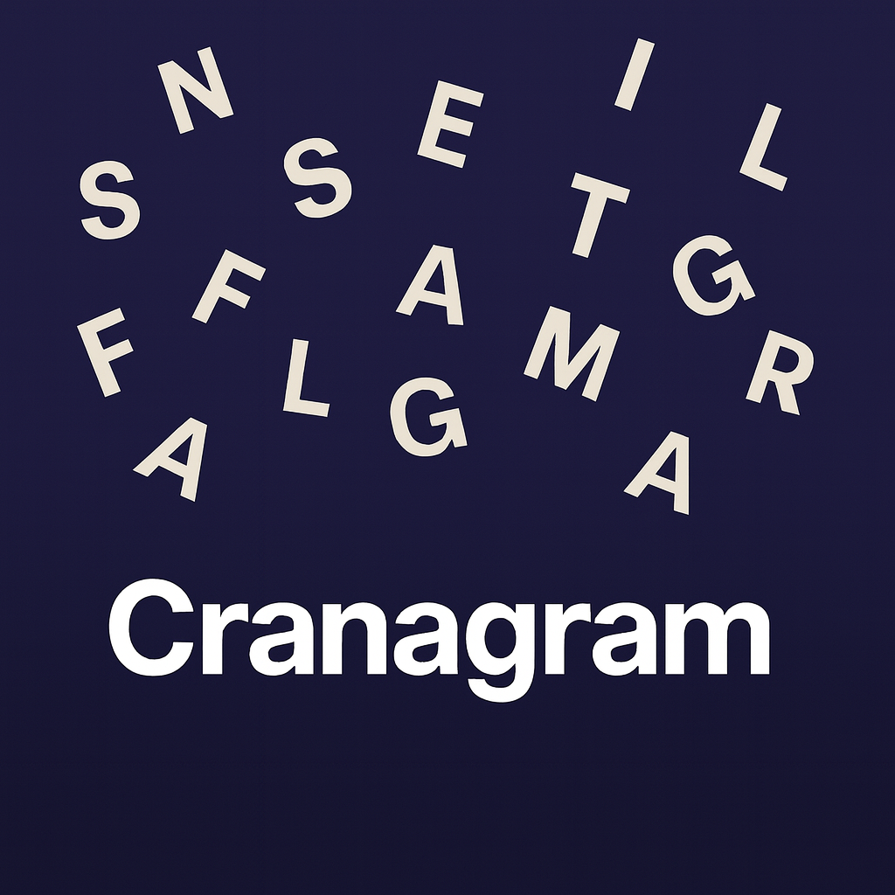

  <a href="index.html" style="color:white; text-decoration:none; font-weight:bold; font-family:Arial, sans-serif;">🏠 Team Home</a>
  <a href="" style="color:white; text-decoration:none; font-weight:bold; font-family:Arial, sans-serif;">📜 Contact</a>

# About
- Team Waffles is currently a solo development team that is operated by @ShastaWaffles (Github) / @wafflesaresomething (Discord)

# Projects

  <a class="project-card" href="cranagram.html" aria-label="Open Cranagram project">
    
    

      <h3 class="project-title">Cranagram - The Discord Activity</h3>
      
Unscramble the words! New words to unscramble every 12 hours for fresh fun. This is the Discord activity that has Cranagram.com integrated within, with some extra fun features such as leaderboards, so you can show your friends how much of a nerd you are! Show your friends how fast you can unscramble these words! 

    

    

      Discord
      Development
    

  </a>

