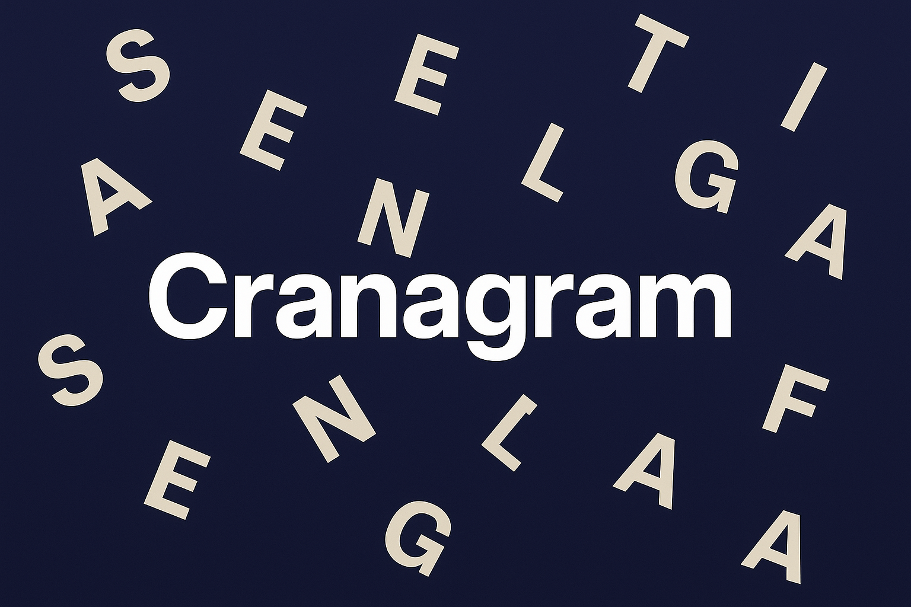

# Cranagram The Disord Activity - Privacy Policy 
**Last Updated:** August 2025

Cranagram - The Discord Activity (“we,” “our,” “us”) values your privacy. This Privacy Policy explains how we handle information when you use our Discord app.

## 1. Information We Collect
- **Basic Discord data**: Such as your username, ID, and server membership (only as provided by Discord).  
- **Activity usage data**: When you launch or interact with Cranagram’s activities.  
- We **do not** collect personal information such as email addresses, phone numbers, or payment information.  

## 2. How We Use Information
- To provide the app’s core functionality.  
- To improve performance and fix issues.  
- To maintain a safe and fair user experience.  

## 3. Data Sharing
- We **do not sell or share** your data with third parties.  
- Data may be stored temporarily for app functionality, but is not permanently retained beyond what is necessary.

## 4. User Control
- You may stop using the app at any time by removing it from your server.  
- If you have concerns, you may contact: **@wafflesaresomething** on Discord.  

## 5. Changes
We may update this Privacy Policy from time to time. Continued use of the Cranagram Discord activity means you accept the updated policy.
