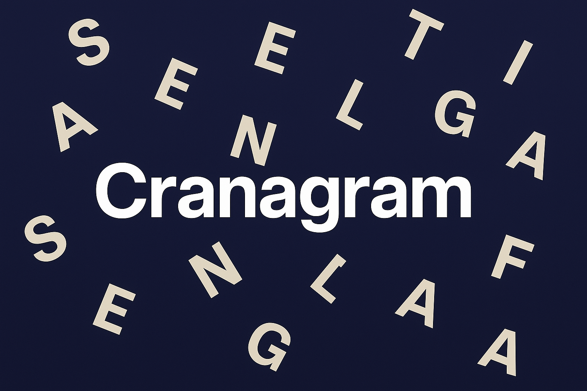

  <a href="index.html">⬅️ Team Home</a>

 

  <a href="cranagram.html" style="color:white; text-decoration:none; font-weight:bold; font-family:Arial, sans-serif;">🏠 Cranagram Home</a>
  <a href="cranagram-privacy.html" style="color:white; text-decoration:none; font-weight:bold; font-family:Arial, sans-serif;">📜 Privacy Policy</a>
  <a href="cranagram-tos.html" style="color:white; text-decoration:none; font-weight:bold; font-family:Arial, sans-serif;">⚖️ Terms of Service</a>
  <a href="cranagram-version.html" style="color:white; text-decoration:none; font-weight:bold; font-family:Arial, sans-serif;">Version History</a>

  

    
🚀 Latest Version: 0.4.0-beta.2

    
Leaderboard improvements, global scoring changes

  

  

    
Released: 2025-08-27

  

<h2>📜 Cranagram Version History</h2>
<table class="version-table">
  <thead>
    <tr>
      <th>Version</th>
      <th>Date</th>
      <th>Changes</th>
    </tr>
  </thead>
  <tbody>
    <tr>
      <td>0.4.0-beta.1</td>
      <td>2025-08-27</td>
      <td>First public beta. Added leaderboards, core scramble gameplay is stable.</td>
    </tr>
    <tr>
      <td>0.4.0-beta.2</td>
      <td>2025-09-??</td>
      <td>Bug fixes and small balance tweaks to the scoring system. Global scoring and leaderboard updates.</td>
    </tr>
  </tbody>
</table>
